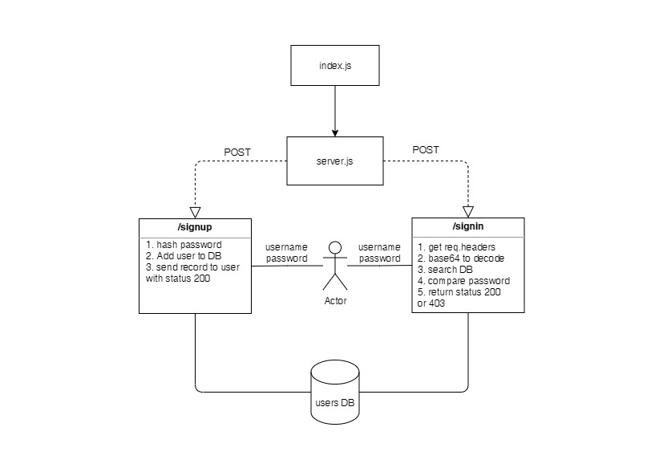

# LAB: Authentication

Authentication System Phase 1: Deploy an Express server that implements Basic Authentication, with signup and signin capabilities, using a Mongo database for storage.

**Author:** Afnan Damra
**Version:** 1.0.0

**Links:**

- [Repo Link](https://github.com/afnandamra/basic-auth)
- [GitHub Actions](https://github.com/afnandamra/basic-auth/actions)
- [Deployed Site](https://afnan-basic-auth.herokuapp.com/)
- [PR Link](https://github.com/afnandamra/basic-auth/pull/1)

## Setup

### Install

- Clone the repository from GitHub
- Run the command `npm i express dotenv morgan base-64 bcrypt cors mongoose jest @codefellows/supergoose` to install dependencies
- create .env file with PORT variable and `MONGODB_URI=mongodb://localhost:27017/auth_1`

### Test

- Run the command `npm test` to test and verify the server and the midddlewares are working.
- Run the command `npm run lint` for testing lint.

### Run

- Start the server using `nodemon`
- Visit http://localhost:PORT at the PORT number you've assigned in your .env

## Documentation

### UML Diagram

Below is a UML of my application (created at https://app.diagrams.net)

## Resources

[Starter code](https://github.com/afnandamra/amman-javascript-401d7/blob/main/class-06/lab/starter-code/app.js)
